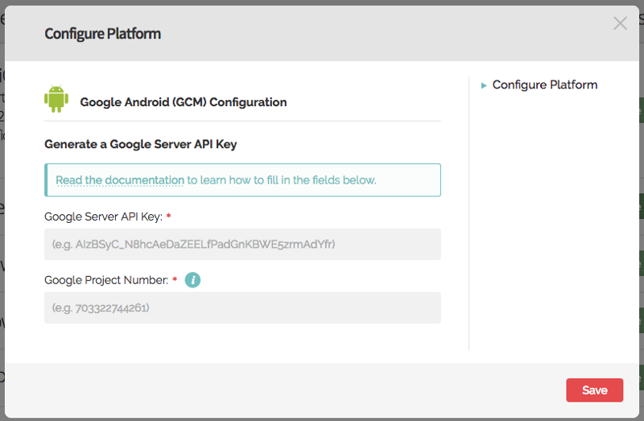
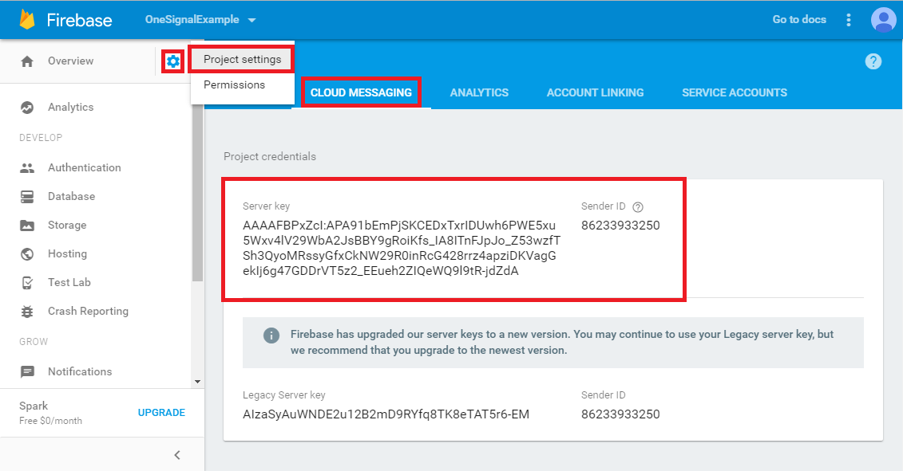
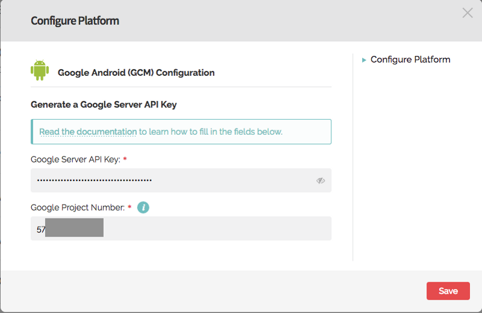
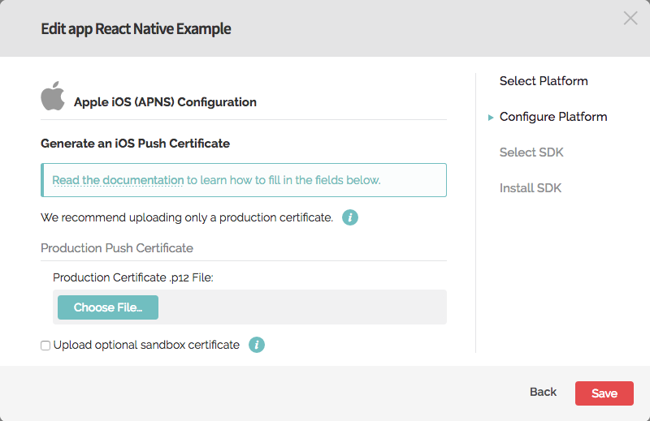
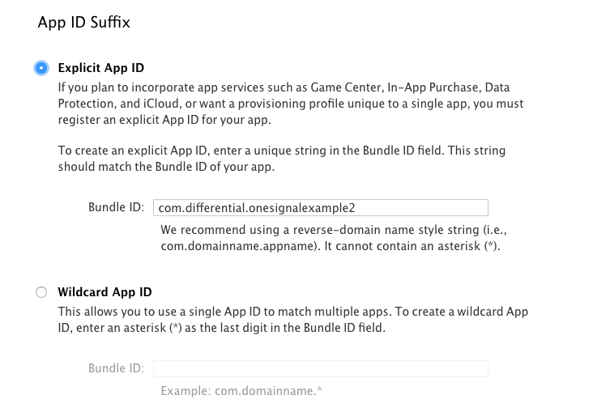
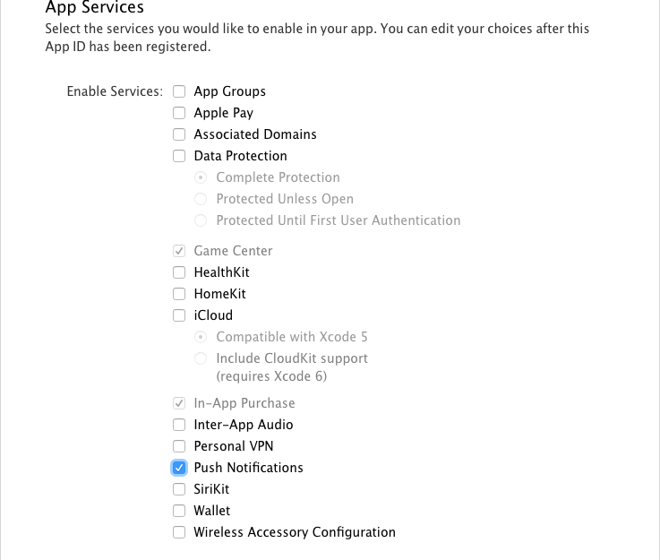
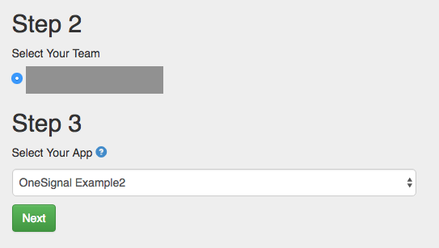
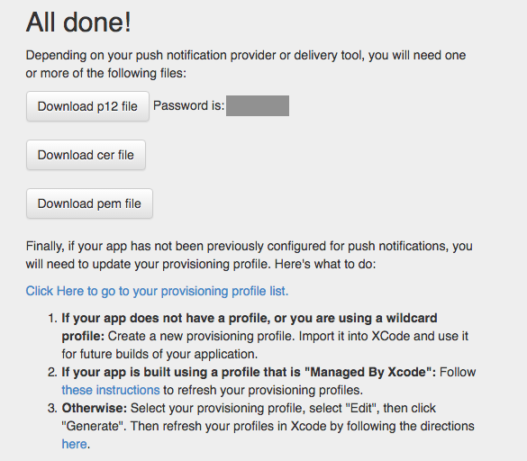
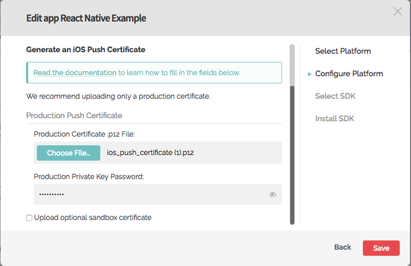

# The ultimate React Native starter using Firebase, Mobx, Code-Push and OneSignal


## Download the app on your phone directly
[![iOS app][2]][1] [![Android app][4]][3]

  [1]: https://itunes.apple.com/us/app/jsapp-my-app/id1165501349?mt=8
  [2]: ./graphics/app-store-badge.png
  [3]: https://play.google.com/store/apps/details?id=me.jsapp.myapp
  [4]: ./graphics/google-play-badge.png  

#### Build your own Instagram + WhatsApp + chat marketplace mobile app clone with push notifications and code deployment integrated

## Built with
 - [React Native](https://facebook.github.io/react-native/) : One language, JavaScript, one source code.
 - [MobX](https://mobxjs.github.io/mobx/) : Simple, scalable state management (easier than Redux)
 - [Firebase](https://firebase.google.com/) : Cloud based database and storage service
 - [CodePush](https://microsoft.github.io/code-push/) : Push code updates to your apps, instantly
 - [OneSignal](https://onesignal.com/) : Unlimited push notifications‎

## How to install this app?
### Prerequisites
To create your own copy of this application, here are the prerequisites:

 - [Yarn](https://yarnpkg.com/) installed on your system or simply use npm if you prefer.
 - [React Native](https://facebook.github.io/react-native/) installed on your system.
 - [Android SDK](https://developer.android.com/studio/index.html) installed to run the app on an android device.
 - [Xcode](https://developer.apple.com/xcode/) installed to test the app on an iOS devices or simulator.

### Build your own copy
Clone the repository using:

```
git clone https://github.com/jsappme/react-native-firebase-starter.git NewApp
cd NewApp
```

You need to choose an **Explicit App ID** (a.k.a **Product Bundle Identifier** in iOS) for your app. For example, the App Id of our demo app is *me.jsapp.myapp*. Find and replace all the instances of *myapp* and *MyApp* with your new App Id in the file names and in the content of all the files in the NewApp folder while respecting the case sensitivity.

For example:
*myapp* --> *newapp*
*NewApp* --> *NewApp*

Now we are ready to install the dependencies using:

```
yarn
```

In order to run the app you will need to setup Firebase (CodePush and OneSignal are optional).

### Firebase Setup:

After **Login** or **Register** at https://firebase.google.com/

Go to your Firebase console: https://console.firebase.google.com/

**Create a new project** and click on **Add Firebase to your web app**.

Open the Firebase config file using your favorite editor (in my case [Atom](https://atom.io/)) and Copy/Paste your Firebase variables:

```
atom src/firebase.js
```

Next setup the **Firebase Auth** by enabling **Email/Password Signup** method:
https://console.firebase.google.com/project/newapp/authentication/providers

Copy and Paste your **Firebase rules** at:
https://console.firebase.google.com/project/newapp/database/rules

```
{
  "rules": {
    ".read": "auth != null",
    ".write": "auth != null",
    "usernameList" : {
      ".read": true
    },
    "posts": {
        ".indexOn": "createdAt",
        ".read": true
    },
    "user_posts": {
      "$uid": {
        "posts": {
          ".indexOn": "createdAt"
        },
      },
    },
    "user_orders": {
      "$uid": {
        "posts": {
          ".indexOn": "createdAt"
        },
      },
    },
    "user_chats": {
      "$uid": {
        "posts": {
          ".indexOn": "updatedAt"
        },
      },
    },
  }
}
```

That's it for Firebase. Now let's setup the push notifications.

### OneSignal Setup

*With the help from this great article by Spencer Carli:
https://medium.com/differential/react-native-push-notifications-with-onesignal-9db6a7d75e1e#.dwpff7u2z*

**Login** or **Register** at https://onesignal.com

**Add new app** and select the Android platform first



Open a new tab and go to your Firebase app Settings > **CLOUD MESSAGING**: https://console.firebase.google.com/project/newapp/settings/cloudmessaging



Save the two values listed:
* **Server key**, a.k.a the **Google Server API key**
* **Sender ID**, a.k.a the **Google Project Number** a.k.a ***my_onesignal_google_project_number*** (you will need it later)*

Copy/Paste those two values on the first tab: OneSignal > **Google Android (GCM) Configuration** and **Save** it



Let's configure the **iOS platform** by clicking on **Configure** next to **Apple iOS** in NewApp > **App Settings**



Open a new tab and **create our app** within the [Apple Developer portal](https://developer.apple.com/account/ios/identifier/bundle)



Enter the **Explicit App ID** of the app, in this case, *me.jsapp.newapp*.

Next **enable Push Notifications** for the app.



Now let's create the provisioning profile. OneSignal has a tool called [The Provisionator](https://onesignal.com/provisionator) that will help with this process.

Sign into your account and make sure you choose the proper team



After pressing **Next**, you’ll see something like this



Download those files and remember the password for the p12 file. Then head back to OneSignal tab, **upload the file**, **enter your password** and **Save**



####Your Push Notification platforms are now set up. Now we can actually work on integrating this with our app.

On your browser, go to OneSignal > NewApp > App Settings > **Keys & IDs** and copy the two values:

* **OneSignal App ID** a.k.a. ***my_onesignal_app_id***
* **REST API Key** a.k.a. ***my_onesignal_api_key***

**Edit**, **Find** and **Replace** these strings by their values into the following files:

* ***my_onesignal_google_project_number*** in:
```
atom android/app/build.gradle
```

* ***my_onesignal_app_id*** in:
```
atom android/app/build.gradle
atom ios/NewApp/AppDelegate.m
atom src/store/AppStore.js
```

* ***my_onesignal_api_key*** in:
```
atom src/store/AppStore.js
```

That's it for the push notification configuration.

### CodePush Setup

Why CodePush? [I am a CodePusher and I love it. Thanks MS and not M$ anymore](https://jsapp.me/i-am-a-codepusher-and-i-love-it-thanks-ms-and-not-m-anymore-7be936e86c75#.e4r2dmyqb)

**Install the CodePush CLI**
https://microsoft.github.io/code-push/index.html#getting_started

```
npm install -g code-push-cli
```

**Create a CodePush account** or **Login** if you have one already.
```
code-push register
```
or
```
code-push login
```
**Register your app** with the service, create one for each platform.

```
code-push app add newapp-and
code-push app add newapp-ios
```

Copy/Paste these **Staging** deployment keys to their respective platform files:

***my_codepush_android_key*** in
```
atom android/app/src/main/res/values/strings.xml
```
***my_codepush_ios_key*** in
```
atom ios/NewApp/Info.plist
```

**Finally link some packages to react native.**
```
react-native link
```

###Congratulation, we are now ready to lunch our app on an android device.
```
react-native run-android
```

To see the logs:
```
react-native log-android
```

###To open the app on Xcode:
```
yarn run ios
```
You might need to add a Signing Team for NewApp and NewApptest to build it.


###To run the app on an iOS simulator:
```
react-native run-ios
```

To see the logs:
```
react-native log-ios
```

### Google Analytics Setup

Edit the Google Analytics Tracker variable:
```
atom src/store/AppStore.js
```


This app is only a starter. Now it's time for some customizations and improvements.


##License
[MIT License](https://github.com/jsappme/react-native-firestack-starter/blob/master/LICENSE). Do whatever you want to do.


## Credits
All the credits goes to all library creators and contributors to the open source repositories and libraries that I am using. I'm very grateful to all of them. Here are some of them:

 - [React Native CodePush](https://github.com/Microsoft/react-native-code-push)
 - [React Native Gifted Chat](https://github.com/FaridSafi/react-native-gifted-chat)
 - [React Native OneSignal](https://github.com/geektimecoil/react-native-onesignal)
 - [React Native Fetch Blob](https://github.com/wkh237/react-native-fetch-blob)
 - [React Native Keyboard Aware Scroll View](https://github.com/APSL/react-native-keyboard-aware-scroll-view)
 - [React Native Image Picker](https://github.com/marcshilling/react-native-image-picker)
 - [Mister Poster](https://github.com/shoumma/Mister-Poster)
 - [React Native](https://facebook.github.io/react-native/)
 - [React Native Animatable](https://github.com/oblador/react-native-animatable)
 - [React Native Scrollable Tab View](https://github.com/skv-headless/react-native-scrollable-tab-view)
 - [React Native Vector Icons](https://github.com/oblador/react-native-vector-icons)
 - [MobX](https://github.com/mobxjs/mobx)
 - [MobX React](https://github.com/mobxjs/mobx-react)
 - [React Native MobX](https://github.com/aksonov/react-native-mobx)
 - [Firebase](https://firebase.google.com/)
 - [Moment JS](http://momentjs.com/)
 - [Lodash](https://lodash.com/)

I really appreciate any suggestions, feedback, PRs and issues.

Made with ♥ by [JSapp.me](http://jsapp.me)
