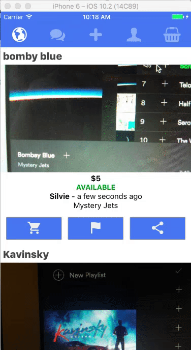

# The ultimate React Native starter using Firebase, Mobx, Code-Push and OneSignal

#### Build your own Instagram + WhatsApp + Chat Marketplace clone

[![iOS app][2]][1] [![Android app][4]][3]

  [1]: https://itunes.apple.com/us/app/jsapp-my-app/id1165501349?mt=8
  [2]: ./graphics/app-store-badge.png
  [3]: https://play.google.com/store/apps/details?id=me.jsapp.myapp
  [4]: ./graphics/google-play-badge.png  

## Built With
 - [React Native](https://facebook.github.io/react-native/) : One language, JavaScript, one source code.
 - [MobX](https://mobxjs.github.io/mobx/) : Simple, scalable state management (easier than Redux)
 - [Firebase](https://firebase.google.com/) : Cloud based database and storage service
 - [CodePush](https://microsoft.github.io/code-push/) : Push code updates to your apps, instantly
 - [OneSignal](https://onesignal.com/) : Unlimited push notifications‎

I would really appreciate any suggestions, feedback, PRs and Issues.

## How to create your own copy of this app?
### Prerequisites
To create your own copy of this application, here are the prerequisites:

 - [Yarn](https://yarnpkg.com/) installed on your system or simply use npm if you prefer.
 - [React Native](https://facebook.github.io/react-native/) installed on your system.
 - Have the [Android SDK](https://developer.android.com/studio/index.html) and paths set properly.
 - An android emulator or real device to run the app.
 - A google account for having [Firebase Web](https://firebase.google.com) configuration.
 - Xcode installed to test the app on an iOS devices or simulator.

### Build your own copy
First clone the repository using:

    git clone https://github.com/jsappme/react-native-firebase-starter.git
    cd react-native-firebase-starter

Then install the dependencies using:

    yarn

To link the react-native-vector-icons package to react native:

    react-native link

Then run the following command to run the app on the emulator.

    react-native run-android

or if you have Xcode installed:

    react-native run-ios

To see the logs:

    react-native log-android

or

    react-native log-ios

##Firebase Setup

Create a new app at:
https://console.firebase.google.com/

Enable the Email/Password provider for your sign-in method at:
https://console.firebase.google.com/project/YOURPROJECT/authentication/providers

Copy your Firebase variables by clicking on Add Firebase to your web app at:
https://console.firebase.google.com/project/YOURPROJECT/settings/general/

Edit and publish your rules and indexOn at:
https://console.firebase.google.com/project/YOURPROJECT/database/rules

with:

    {
      "rules": {
        ".read": "auth != null",
        ".write": "auth != null",
        "usernameList" : {
          ".read": true
        },
        "posts": {
            ".indexOn": "createdAt",
            ".read": true
        },
        "user_posts": {
          "$uid": {
            "posts": {
              ".indexOn": "createdAt"
            },
          },
        },
        "user_orders": {
          "$uid": {
            "posts": {
              ".indexOn": "createdAt"
            },
          },
        },
        "user_chats": {
          "$uid": {
            "posts": {
              ".indexOn": "updatedAt"
            },
          },
        },
      }
    }

and edit the firebase configuration file with your own settings:

    atom src/firebase.js

Now, you have your own copy of this application!

##License
[MIT License](https://github.com/jsappme/react-native-firestack-starter/blob/master/LICENSE). Do whatever you want to do.

## Credits
All the credits goes to all library creators and contributors to the open source repositories and libraries that I am using. I'm very grateful to all of them.

 - [React Native Fetch Blob](https://github.com/wkh237/react-native-fetch-blob)
 - [React Native Keyboard Aware Scroll View](https://github.com/APSL/react-native-keyboard-aware-scroll-view)
 - [React Native Image Picker](https://github.com/marcshilling/react-native-image-picker)
 - [React Native Cacheable Image](https://github.com/jayesbe/react-native-cacheable-image)
 - [Mister Poster](https://github.com/shoumma/Mister-Poster)
 - [React Native](https://facebook.github.io/react-native/)
 - [React Native Animatable](https://github.com/oblador/react-native-animatable)
 - [React Native Scrollable Tab View](https://github.com/skv-headless/react-native-scrollable-tab-view)
 - [React Native Vector Icons](https://github.com/oblador/react-native-vector-icons)
 - [MobX](https://github.com/mobxjs/mobx)
 - [MobX React](https://github.com/mobxjs/mobx-react)
 - [React Native MobX](https://github.com/aksonov/react-native-mobx)
 - [Firebase](https://firebase.google.com/)
 - [Moment JS](http://momentjs.com/)
 - [Lodash](https://lodash.com/)

Made with ♥ by [JSapp.me](http://jsapp.me)
