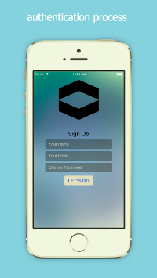
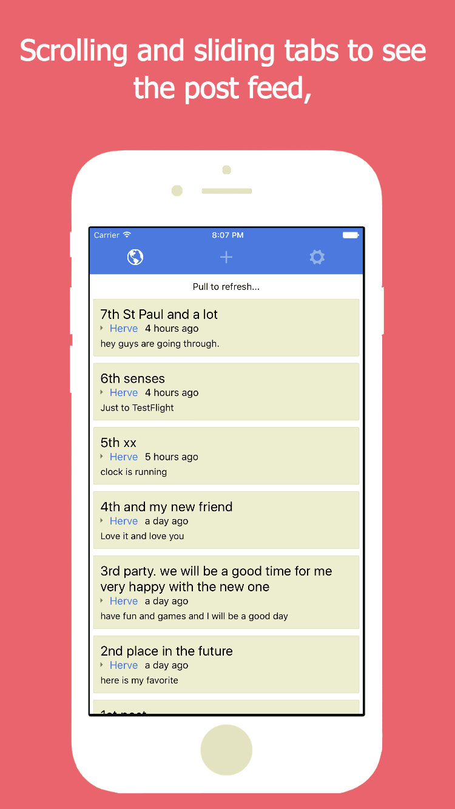
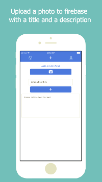

# JSapp React Native Firebase Starter App

#### Build your React Native / Firebase hybrid iOS and Android app, 0 to 100 (Real Quick)

[![iOS app][2]][1] [![Android app][4]][3]

  [1]: https://itunes.apple.com/us/app/jsapp-my-app/id1165501349?mt=8
  [2]: ./graphics/app-store-badge.png
  [3]: https://play.google.com/store/apps/details?id=me.jsapp.myapp
  [4]: ./graphics/google-play-badge.png  

## Built With
 - [React Native](https://facebook.github.io/react-native/)
 - [MobX](https://mobxjs.github.io/mobx/)
 - [Firebase](https://firebase.google.com/)

I would really appricate any suggestions, feedback, PRs and Issues.

## How to create your own copy of this app?
### Prerequisites
To create an own copy of this application, you have some prerequisites. They are -

 - [Yarn](https://yarnpkg.com/) installed on your system.
 - [React Native](https://facebook.github.io/react-native/) installed on your system.
 - Have the [Android SDK](https://developer.android.com/studio/index.html) and paths set properly.
 - An android emulator or real device to run the app.
 - A google account for having [Firebase Web](https://firebase.google.com) configuration.
 - Xcode installed to install and test the app on an iOS devices or simulator.

### Build your own copy
First clone the repository using:

    git clone https://github.com/jsappme/react-native-firebase-starter.git
    cd react-native-firebase-starter

Then install the dependencies using:

    yarn

To link the react-native-vector-icons package to react native:

    react-native link

Then run the following command to run the app on the emulator.

    react-native run-android

or if you have Xcode installed:

    react-native run-ios

To see the logs:

    react-native log-android

or

    react-native log-ios

Feel free to edit the firebase configuration file with your own settings:

    atom src/firebase.js

Now, you have your own copy of this application!

##License
[MIT License](https://github.com/jsappme/react-native-firestack-starter/blob/master/LICENSE). Do whatever you want to do.

## Credits
All the credits goes to all library creators and contributors to the open source repositories and libraries that I am using. I'm very grateful to all of them.

 - [Mister Poster](https://github.com/shoumma/Mister-Poster)
 - [React Native](https://facebook.github.io/react-native/)
 - [React Native Animatable](https://github.com/oblador/react-native-animatable)
 - [React Native Scrollable Tab View](https://github.com/skv-headless/react-native-scrollable-tab-view)
 - [React Native Vector Icons](https://github.com/oblador/react-native-vector-icons)
 - [MobX](https://github.com/mobxjs/mobx)
 - [MobX React](https://github.com/mobxjs/mobx-react)
 - [React Native MobX](https://github.com/aksonov/react-native-mobx)
 - [Firebase](https://firebase.google.com/)
 - [Moment JS](http://momentjs.com/)
 - [Lodash](https://lodash.com/)

Made with ♥ by [JSapp.me](http://jsapp.me)
